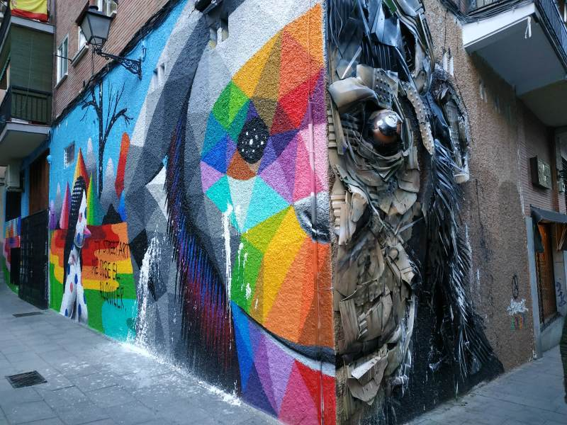

# Leeds to Madrid

We set off bright and early from our house the the Leeds train station.
Next stop: Madrid.

```{r, fig.cap="Like most trips, this one has an obligatory bike photo. Saying goodbye to Leeds."}
knitr::include_graphics("IMG_20190518_064058.jpg")
```

```{r}
leaflet() %>% 
  addTiles() %>% 
  addPopups(data = p[1:2, ], popup = c(
    "Leeds rail station",
    "Destination: Madrid"
  )) 
# %>% 
#   addMiniMap(zoomLevelOffset = -7)
```

We spent 3 nights in Madrid, staying with a friendly family in Aravaca.

```{r, fig.cap="Celebratory tapas in first place we found, Bar El 89, 'El Bar de Toda la Vida'."}
knitr::include_graphics("IMG_20190518_152257.jpg")
```


```{r, fig.cap="Amazing street art of Madrid near the Tabacalera, a cooperatively run community and arts centre."}

```

