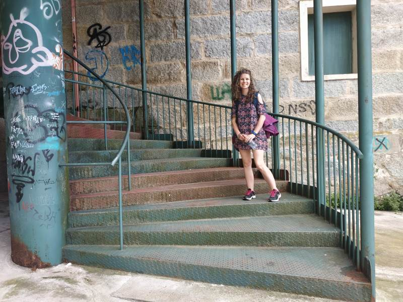
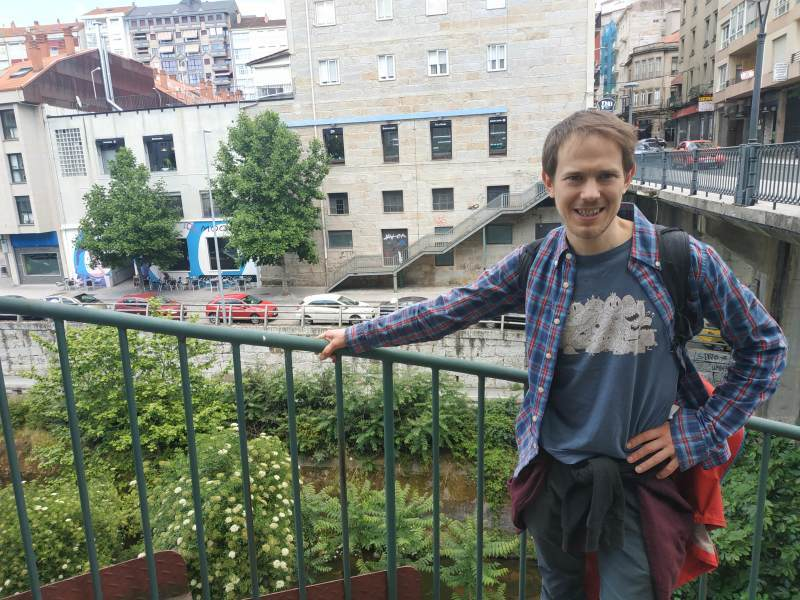

# 3

  


```{r, fig.cap="Arrival in Salamanca. Enjoying the beauty of the city and the rivers."}
knitr::include_graphics("IMG_20190520_195619.jpg")
```


```{r, fig.cap="Panoramic of the historic bridge over the river and the mysterious fluff that fell from the trees like snow."}
knitr::include_graphics("IMG_20190520_201047.jpg")
```


```{r, fig.cap="Us on the historic bridge, with the main cathedral of Salamanca in the background"}
knitr::include_graphics("IMG_20190520_201518.jpg")
```


```{r, fig.cap="Makeshift skatepark outside a dissused church. People have been worshipping here for almost 2 decades. 12 years ago Robin was one of them!"}
knitr::include_graphics("IMG_20190521_143559.jpg")
```


```{r, fig.cap="Peaceful 3 course meal in the hidden terreza of the famous Don Quijote cafe."}
knitr::include_graphics("IMG_20190521_153335.jpg")
```


```{r, fig.cap=""}

```


```{r, fig.cap="Casa de las Conchas, famous historic building in the old city that houses the public library."}

```


