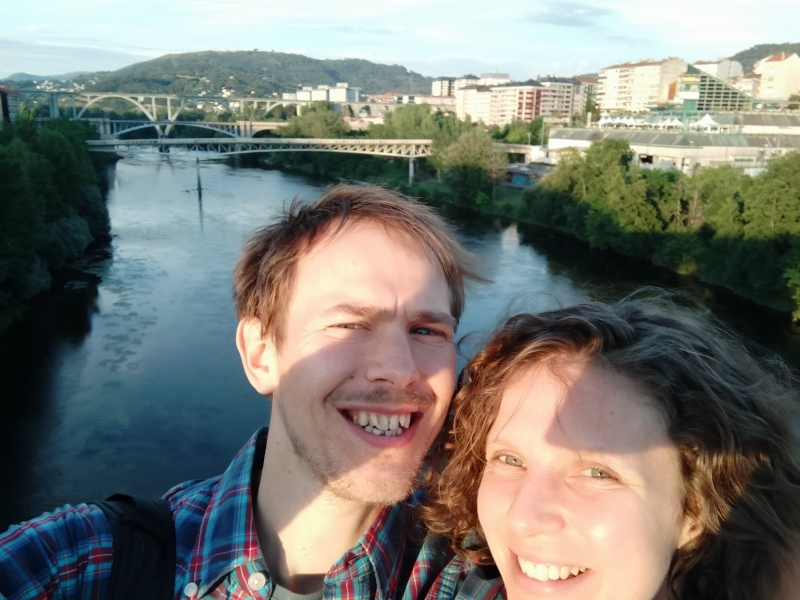
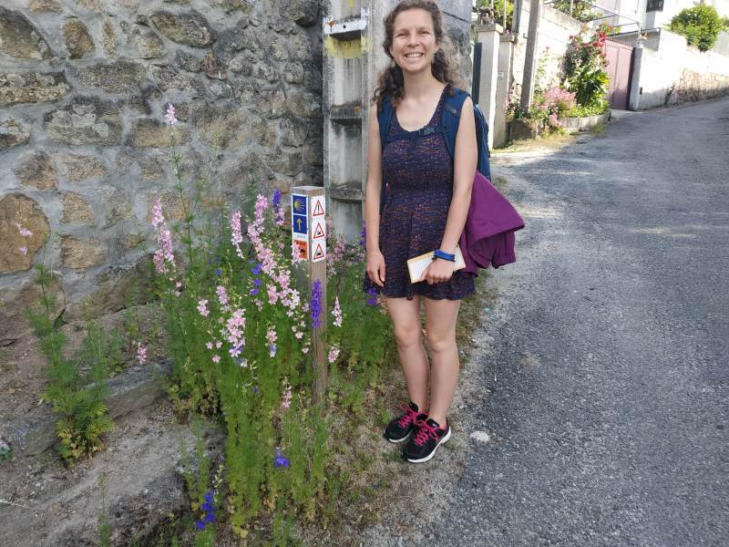
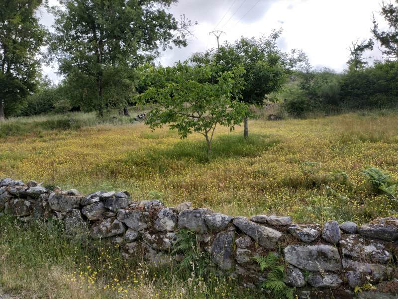
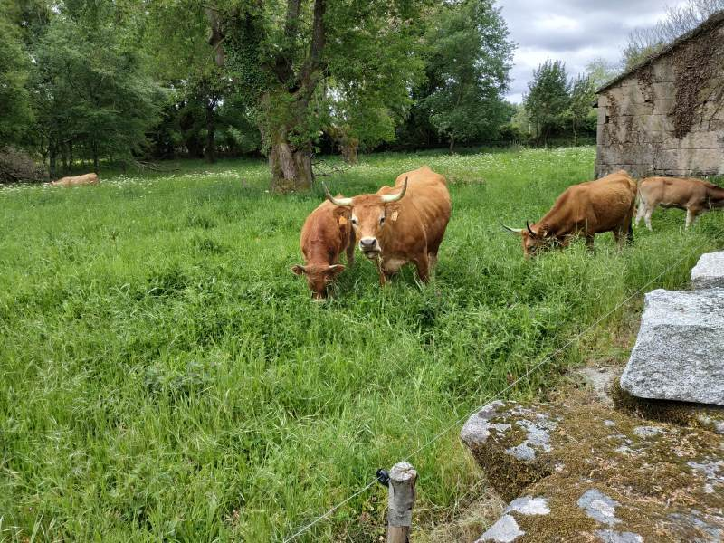
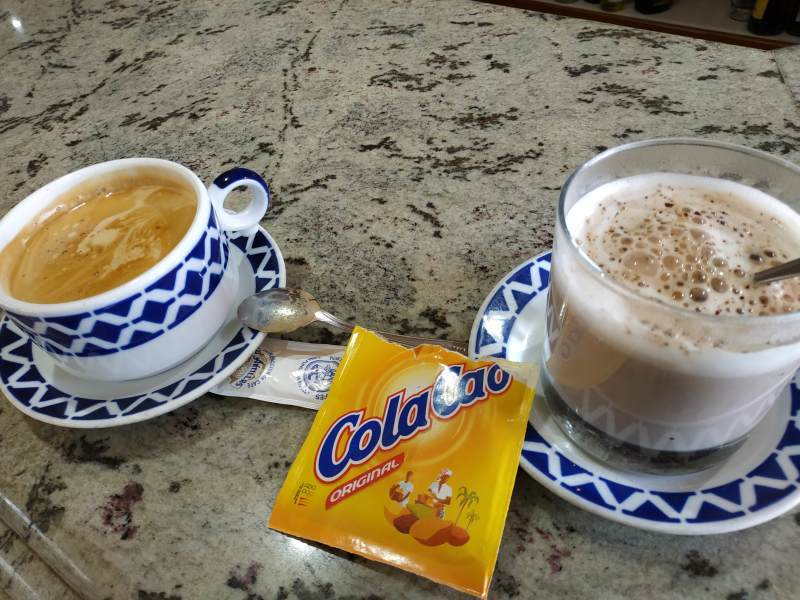
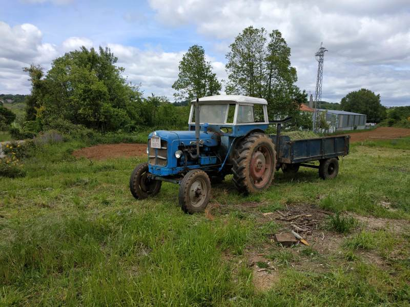
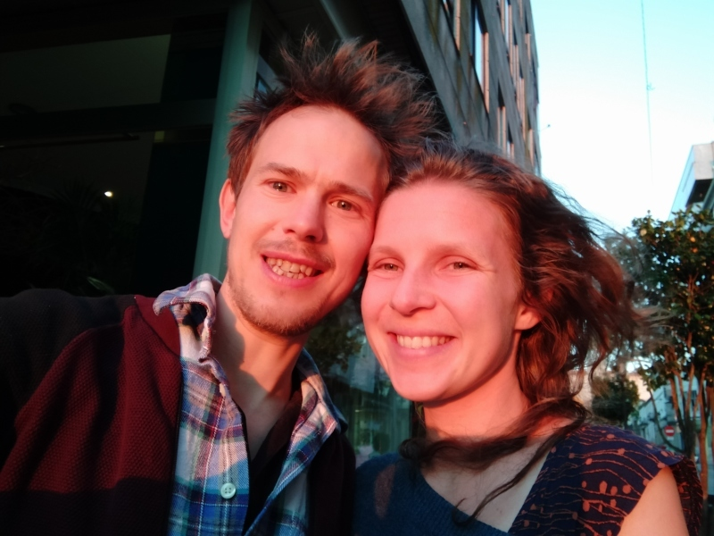

# Camino day 1: Ourense to Pezos

```{r}
leaflet() %>% 
  addTiles() %>% 
  addMarkers(data = g4[1:19, ])
```


```{r, fig.cap="Arrival in Ourense, climbing a spiral staircase on the way to the AirBnB."}
knitr::include_graphics("IMG_20190522_161635.jpg")

```


```{r, fig.cap="View from the top of the spiral staircase."}
knitr::include_graphics("IMG_20190522_161735.jpg")
```


```{r, fig.cap="The amazing hot springs of Ourense."}
knitr::include_graphics("IMG_20190522_194521.jpg")
```


```{r, fig.cap="Enjoying the local beer to re-hydrate after bathing in the hot springs."}
knitr::include_graphics("IMG_20190522_203034.jpg")
```


```{r, fig.cap="How many bridges? Photo from the oldest bridge in Ourense."}

```


```{r, fig.cap="The first stage of the Camino.", out.width="50%"}
f = "IMG_20190523_094920.jpg"
# i = magick::image_read(f)
# ir = magick::image_rotate(i, 90)
# magick::image_write(ir, f)
knitr::include_graphics(f)
```


```{r, fig.cap="Admiring the flores on the outskirts of Ourense. Finally we escaped the cities!"}

```


```{r, fig.cap="Wildflower meadow on the Camino. Dozens of these surround the route."}

```


```{r, fig.cap="Closeup of the wildflowers."}
knitr::include_graphics("IMG_20190523_102113.jpg")
```


```{r, fig.cap="View of Ourense from the top of the first hill: reward for the climb."}
knitr::include_graphics("IMG_20190523_102128.jpg")
```


```{r, fig.cap="Las vacas munched on verdent grass while we lunched."}

```


```{r, fig.cap="Giant brassicas, as tall as a person."}
knitr::include_graphics("IMG_20190523_130101.jpg")
```


```{r, fig.cap="The most sheep-like dog we've ever seen, in the garden of a friendly local who showed us around."}
knitr::include_graphics("IMG_20190523_133759.jpg")
```


```{r, fig.cap="Robin in full 'peregrino' mode, complete with herbs given to us along the way."}
knitr::include_graphics("IMG_20190523_134136.jpg")
```


```{r, fig.cap="Abandoned grain stores and derilict stone buildings are a key feature of the settlements in this area."}
knitr::include_graphics("IMG_20190523_140106.jpg")
```


```{r, fig.cap="Abundant plantlife covered every surface. Suculants growing on a stone wall."}
knitr::include_graphics("IMG_20190523_141202.jpg")
```


```{r, fig.cap="Grain silos in every direction, over a darkening Galician sky."}
knitr::include_graphics("PANO_20190523_130455.jpg")
```


```{r, fig.cap="Galician garden. Allotments and gardens with delicious-looking vegetables dotted the route of el camino."}
knitr::include_graphics("IMG_20190523_142043.jpg")
```


```{r, fig.cap="A shrine to the bike."}
knitr::include_graphics("IMG_20190523_142359.jpg")
```


```{r, fig.cap="View from our window after the first day of walking the Camino.", out.width="50%"}
f = "IMG_20190523_175552.jpg"
# i = magick::image_read(f)
# ir = magick::image_rotate(i, 90)
# magick::image_write(ir, f)
knitr::include_graphics(f)
```

# Camino: Pezos to Lalín


```{r}
leaflet() %>% 
  addTiles() %>% 
  addMarkers(data = g4[-(1:19), ])
```


```{r, fig.cap="Early morning start for the megaday, in preparation for a ~40km walk from Pezos to Lalin."}
knitr::include_graphics("IMG_20190524_073324.jpg")
```


```{r, fig.cap="Poster promoting the PSOE, one of many parties campaigning for the upcoming local, regional and European elections."}
knitr::include_graphics("IMG_20190524_084154.jpg")
```


```{r, fig.cap="Reward for another long climb: stunning views and bountiful giant gorse bushes alongside bright purple heather."}
knitr::include_graphics("IMG_20190524_105818.jpg")
```


```{r, fig.cap="The most welcome refreshment of the entire trip: Iberian favourite ColaCao and Cafe con Leche at the only resting place for miles."}

```


```{r, fig.cap="Despite tired legs, we still had time for play. Swings on the home straight."}
knitr::include_graphics("IMG_20190524_134012.jpg")
```


```{r, fig.cap="More abundant nature. Galicia teams with waterways and greenery."}
knitr::include_graphics("IMG_20190524_140724.jpg")
```


```{r, fig.cap="Old tractor just outside Lalin, the final destination. Traditional agriculture continues apace."}

```


```{r, fig.cap="Enjoying the sunshine and a chance to rest our feet outside the church in the Plaza Mayor of Lalin."}
knitr::include_graphics("IMG_20190524_185535.jpg")
```


```{r, fig.cap="Robin proudly poses outside a statue of his new hero: the Galician Mathematician Ramon Aller."}
knitr::include_graphics("IMG_20190524_185841.jpg")
```


```{r, fig.cap="Lego brick staircase typifying the playful architecture in Lalin."}
knitr::include_graphics("IMG_20190524_191302.jpg")
```


```{r, fig.cap="Triumphant stance next to a bright purple field of flowers."}
knitr::include_graphics("IMG_20190524_200740.jpg")
```


```{r, fig.cap="Revelling in the flowers before having to head back to the big cities."}
knitr::include_graphics("IMG_20190524_200945.jpg")
```


```{r, fig.cap="Tired but still going! Bathing in the sunset before dinner in Lalin."}

```


